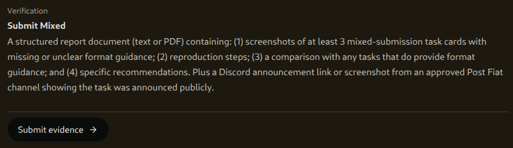
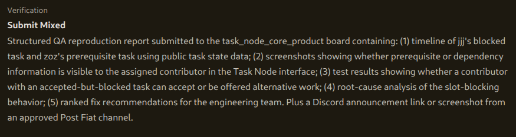
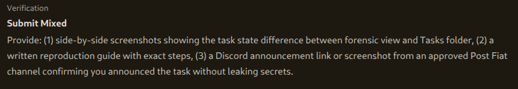
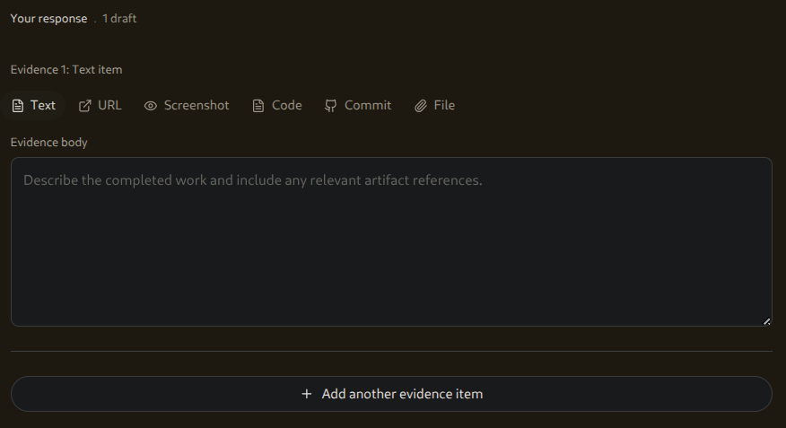
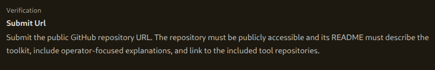

# QA Audit: Missing File-Format Guidance on Mixed-Submission Task Cards

**Task:** `task_331e57836b8de46d50d1601b81370581` — Audit Mixed-Submission Task Cards for Missing File Format Guidance
**Board:** Task Node Core Product
**Author:** walkonwayvs (pft.bigwoodnode.com)
**Method:** Manual audit of the live Task Node interface using only publicly visible task cards and the operator's own accepted-task submission screen.

---

## Summary

Mixed-submission tasks (the "Submit Mixed" type, requiring a document/URL **plus** a Discord announcement) do not give contributors a consistent, explicit statement of which file formats are acceptable. Across the cards audited, format guidance is either buried in a prose parenthetical or absent entirely, and no card exposes a dedicated "Accepted formats" field. The ambiguity carries through to the submission screen, where a **File** evidence type is offered with no indication of accepted formats. This matches the confusion raised by operator jjj in Hive chat ("what file format do I use?") and is the gap this report documents.

---

## 1. Task cards audited (missing or unclear format guidance)

All three cards below are the "Submit Mixed" type. None presents a labeled format field; each describes the deliverable in a sentence, with format guidance either vague or absent.

### Card 1 — `task_331e57836...` (this task)
Verification block reads "A structured report document (**text or PDF**)...". Format is mentioned, but only as a parenthetical inside a long sentence — not a labeled field, and easy to miss.

### Card 2 — Prerequisite-blocking QA reproduction task
Verification requires a "Structured QA reproduction report" plus a Discord announcement. **No file format is stated anywhere** — the contributor is not told whether the report should be PDF, text, markdown, or a URL.

### Card 3 — Forensic-view vs Tasks-folder reproduction task
Verification requires side-by-side screenshots, a written reproduction guide, and a Discord announcement. Again **no file format is stated** — same gap as Card 2.

**Observed pattern (confirmed):** format guidance is inconsistent across mixed-submission cards — one card mentions "text or PDF" in prose, two mention nothing. No card presents format guidance as a distinct, labeled field.

---

## 2. Reproduction: the contributor confusion path

Reproduced on a live accepted task (`task_331e...`) using only the standard Task Node interface:

1. **Accept** a mixed-submission task.
2. On the **Overview** tab, read the Verification / "Submit Mixed" block. Format guidance is either a vague parenthetical ("text or PDF") or absent.
3. Open the **Submit** tab → **Add evidence**. Six evidence types are offered: **Text / URL / Screenshot / Code / Commit / File**.
4. Select **File**. There is no statement of accepted file formats, size limits, or which types the verifier can read. The Evidence body placeholder only says "Describe the completed work and include any relevant artifact references."
5. The contributor is left to guess which format is acceptable — the exact point of confusion.

**Confirmed:** at no step — card description or submission screen — is the contributor given an explicit, reliable statement of accepted file formats for the File evidence type.

---

## 3. Comparison with cards that do provide clearer guidance

The clearest cards in the interface are **"Submit Url"** tasks, which sidestep the problem entirely by requiring a public URL and no file:

This card tells the contributor exactly what to submit (a public GitHub repository URL) and what it must contain. Because there is no file, there is no format ambiguity.

**Key contrast:** URL-only tasks are unambiguous because they don't involve a file. Mixed-submission tasks reintroduce ambiguity precisely because they accept a file but never say which formats qualify. The fix is not to remove the File option — it is to state, on the card and at submission, what that File may be.

**Inferred (not confirmed):** based on prior submissions, publicly fetchable URLs (e.g. GitHub markdown) tend to verify most reliably, and self-attested uploaded files score lower because the verifier can't independently fetch them. This is operator experience, not a documented rule, and is offered only as context for the recommendation below.

---

## 4. Recommendations

1. **Add a labeled "Accepted formats" field to every task card that can take a file.** Render it in the Verification block as its own line, not buried in prose. Example: `Accepted formats: public URL (preferred), PDF, .md, or .txt`.
2. **Make it consistent across all mixed-submission cards.** Every "Submit Mixed" card should carry the field with the same wording — eliminate the current mix of "text or PDF," nothing at all, and prose-only mentions.
3. **Surface accepted formats on the Submit evidence screen**, inline with the **File** button (helper text or tooltip), so the guidance appears at the exact moment the contributor is choosing a format.
4. **State the preferred path where one scores best.** If a publicly fetchable URL verifies more reliably than an uploaded file, say so on the card (e.g. "Public URL preferred") so contributors aren't guessing at the highest-quality submission.

---

## Scope and honesty notes

- All "missing/unclear guidance" findings are **confirmed** from the live interface (screenshots above).
- The URL-reliability point in §3 is **inferred** from operator experience and labeled as such.
- This audit covers the cards visible to this operator; it does not claim to be an exhaustive census of every card on every board.
