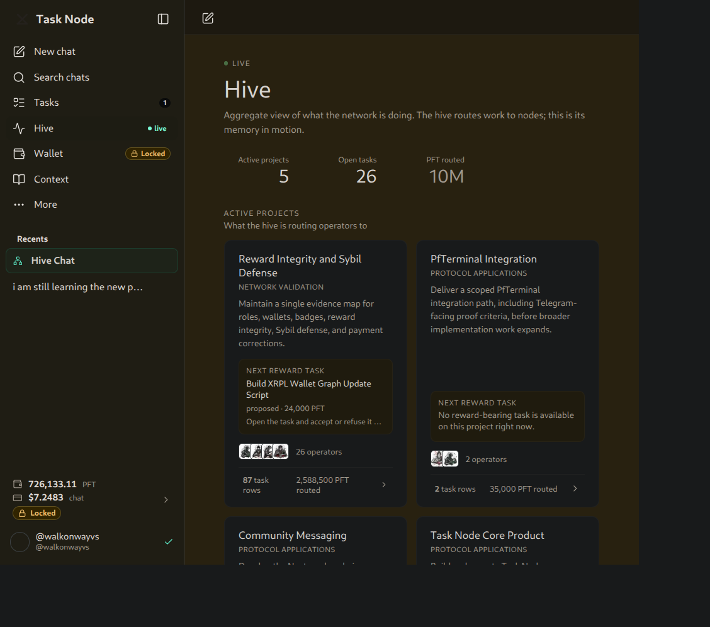
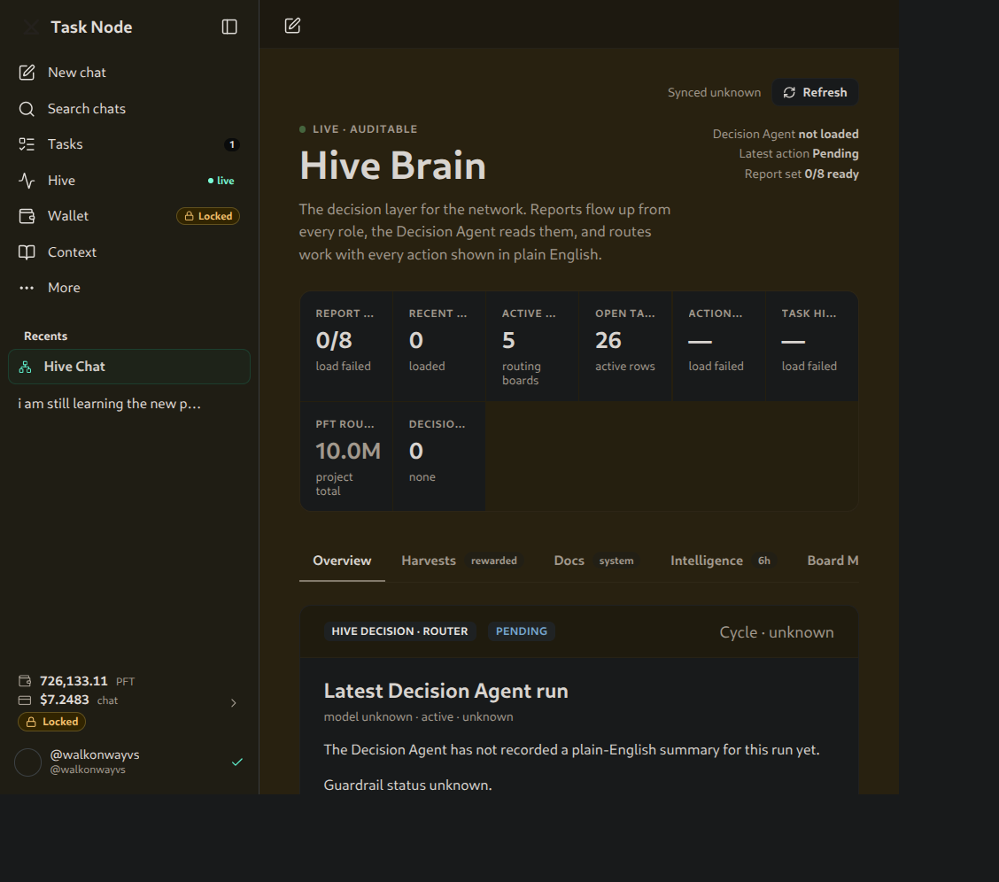
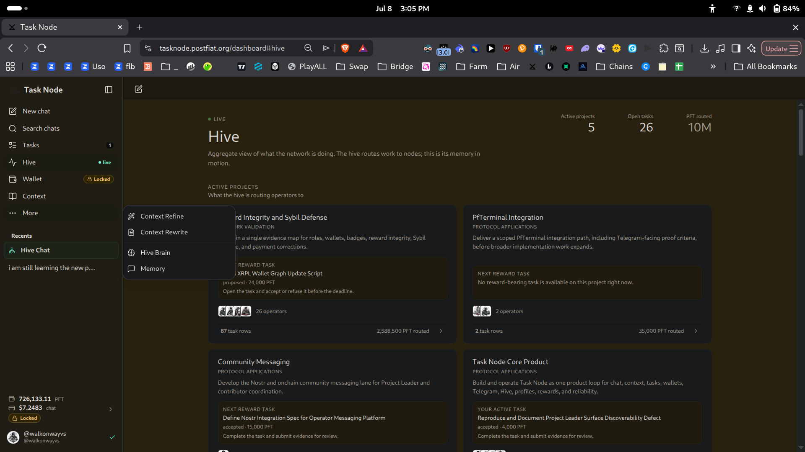
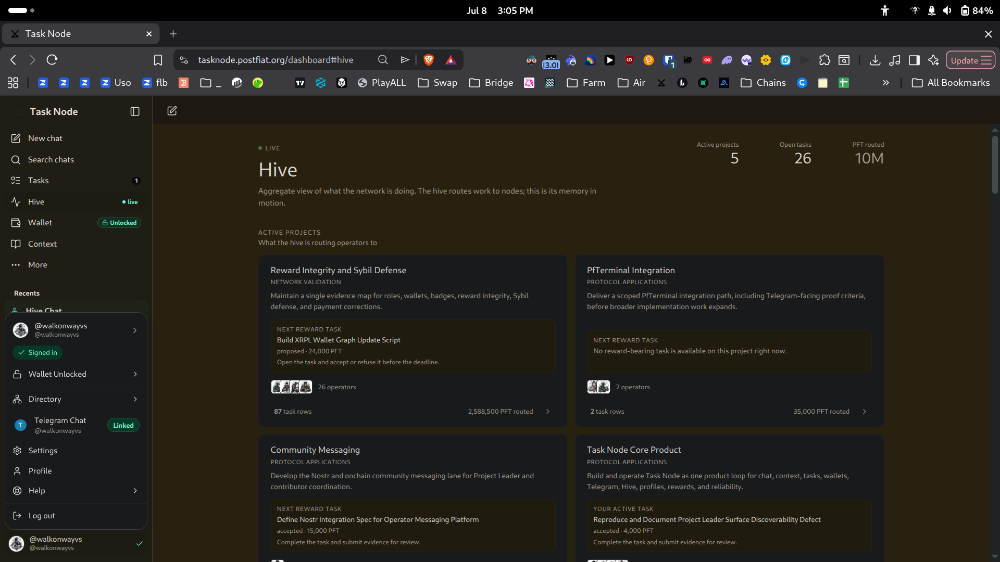
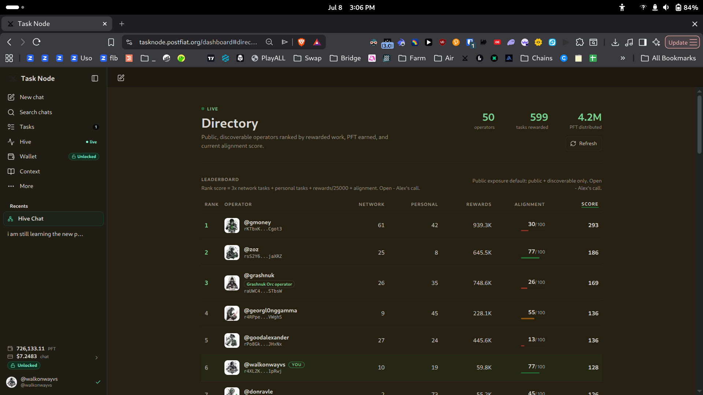
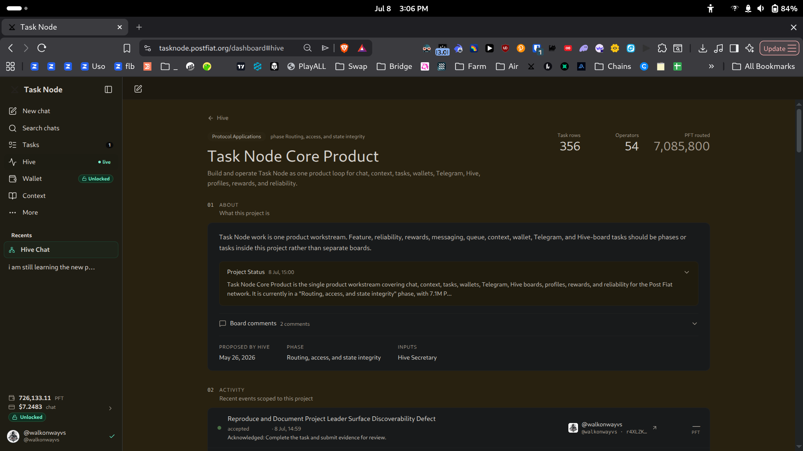

# QA Reproduction: Project Leader Surface Discoverability Defect

**Task:** `task_000608248879387f4659048230e900ac` — Reproduce and Document Project Leader Surface Discoverability Defect
**Board:** Task Node Core Product
**Author:** walkonwayvs (pft.bigwoodnode.com)
**Account role:** QA Worker
**Interface audited:** tasknode.postfiat.org/dashboard (public web interface, logged in)
**Date:** 08 Jul 2026

---

## Summary

A verified Project Leader (zoz) publicly asked "where is the project leader surface?" and received no response, and six of seven Project Leaders show no recent chat activity. This report documents a full walk of the Task Node navigation from a logged-in account to determine whether any Project Leader dashboard, management, or settings surface is discoverable.

**Result:** No Project Leader management surface is discoverable anywhere in the Task Node navigation from a standard logged-in account. Every top-level nav entry, the overflow ("More") menu, the profile menu, the Directory, and an individual project detail page were examined; none exposes a leader dashboard, project-management controls, or a leader-only settings surface.

**Conclusion (bounded):** The Project Leader surface is **not discoverable from a standard logged-in account**. Whether a permission-gated surface exists server-side that renders only for a different role level is outside what this account can inspect — see [Limitations](#limitations). What is confirmed is that discoverability fails: a Project Leader following the visible navigation has no path to a management surface, which is consistent with zoz's unanswered question and the silent-leader pattern.

---

## Navigation walked, path by path

The full navigation is the left sidebar: New chat, Search chats, Tasks, Hive, Wallet, Context, More — plus the profile menu at bottom-left. Each candidate path was opened and captured full-page with the URL bar visible.

### 1. Hive → Hive Brain (`/dashboard#hive`)
The network decision layer (Decision Agent, report routing). No leader surface.

### 2. Hive → project list (`/dashboard#hive`)
Aggregate view of active projects and routing. Projects are *listed* (Reward Integrity, PfTerminal, Community Messaging, Task Node Core Product, etc.), but no per-project "manage" control is present for a leader.

### 3. Sidebar → More
Opens: Context Refine, Context Rewrite, Hive Brain, Memory. No Project Leader surface.

### 4. Profile menu (bottom-left → @walkonwayvs)
Opens: Wallet, Directory, Telegram Chat, Settings, Profile, Help, Log out. No Project Leader dashboard or management entry.

### 5. Profile menu → Directory (`/dashboard#directory`)
A public operator leaderboard ranked by rewarded work, PFT, and alignment. This is a *discovery/ranking* surface, not a leader *management* surface — a Project Leader cannot manage a project from here.

### 6. Project card → project detail (Task Node Core Product)
Opening a project shows About, Project Status, board comments, and an activity feed. It is read-oriented: there are no leader controls to configure the project, assign/route tasks, or manage contributors.

---

## Findings

- The complete visible navigation was walked. No entry — top-level, overflow, profile, Directory, or project detail — exposes a Project Leader dashboard, management console, or leader-only settings surface.
- Projects and operators are both *viewable* (Hive project list, project detail pages, Directory leaderboard), but nothing offers *management* affordances scoped to a Project Leader.
- The absence is consistent across every path, not isolated to one menu.

## Conclusion

**Does not exist as a discoverable surface.** From a standard logged-in account there is no navigable path to a Project Leader management surface. This directly reproduces the reported condition: a Project Leader (zoz) asking where the surface is, with no discoverable answer in the interface, and leaders going inactive because there is no surface routing them to leader-specific work.

## Limitations

This audit is bounded to what a logged-in **QA Worker** account can see in the public web interface. It confirms the surface is **not discoverable** via navigation. It does **not** establish whether a permission-gated surface exists server-side that renders only for a Project-Leader-scoped session — that is not inspectable from this account, and this report makes no claim either way. The confirmed defect is discoverability, independent of whether a hidden surface exists.

## Ranked recommendations

1. **If a Project Leader surface exists but is permission-gated:** add a visible, role-gated nav entry (e.g. a "Projects" or "Leader" item in the sidebar or profile menu) that appears for Project Leader badge holders. The defect is that even the *entry point* is absent, so a leader has no way to reach it.
2. **If no surface exists yet:** build a minimal Project Leader dashboard (owned projects, routed tasks, contributor/reward status) and route leaders to it on login. This is what would re-engage the silent leaders.
3. **Add management affordances to the existing project detail page.** The project detail view (path 6) is the natural home — extend it with leader-only controls (task routing, status updates, contributor management) shown only to that project's leader.
4. **Surface a leader entry on the Directory or Hive.** Leaders already appear in ranking/aggregate views; add a "manage" affordance from those surfaces for the acting leader as a discoverable shortcut.
5. **Answer zoz's question in-channel** with the resulting path once it exists, to close the reported thread and signal the fix to the other inactive leaders.
