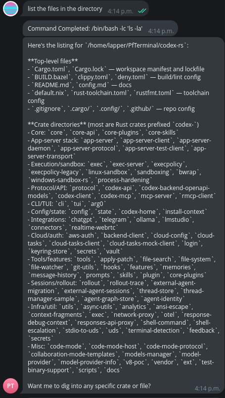
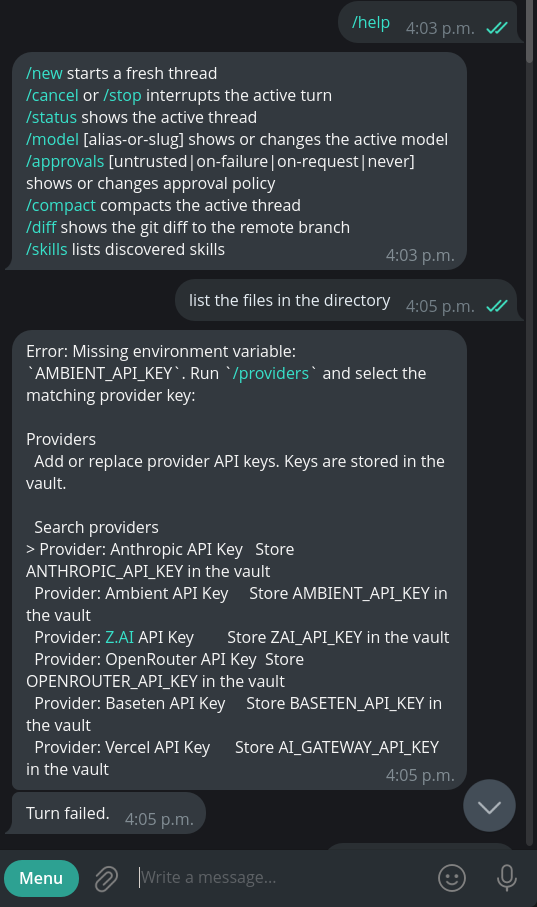
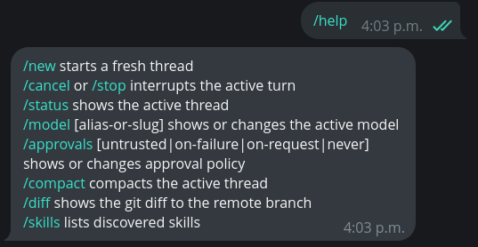
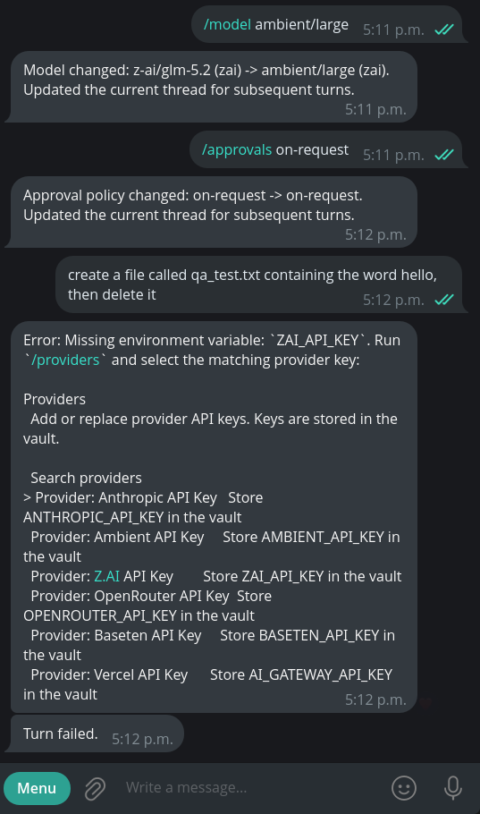
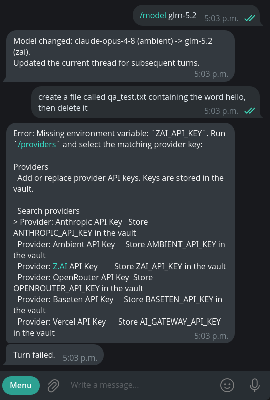
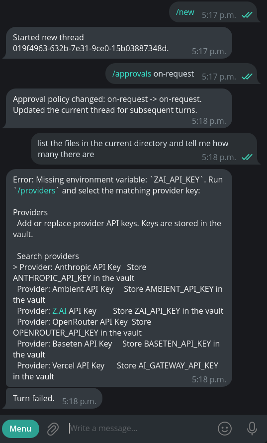
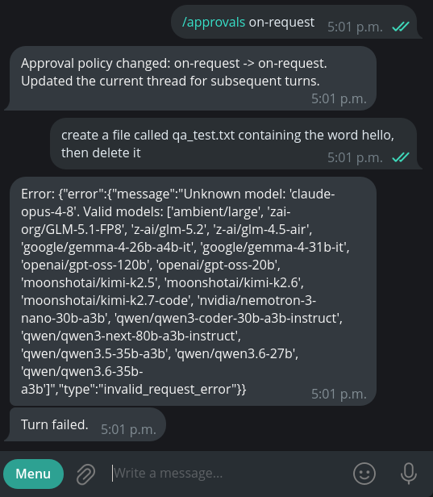

# QA Report: PfTerminal PR #37 — Telegram Connector, Live Validation

**Task:** `task_bcbc3541b21dd5183ae4faed34477a1e` — Review PfTerminal PR #37 and Validate Telegram Demo
**Repository:** github.com/agtico/PfTerminal · **PR #37** (`feat/telegram-connector` → `main`)
**Tested commit:** `76954182e1fe610a41be8773c580487a2386d662` (PR #37 HEAD)
**Spec validated against:** PfTerminal ↔ Telegram Integration Project Definition (`task_2489fbc99843d76d570524c652c9919b`), proof criteria P1–P7
**Reviewer:** walkonwayvs (independent operator) · **Method:** built the `pfterminal` binary from PR #37 on Pop!_OS, ran the `pfterminal telegram` connector live against a dedicated BotFather test bot, and exercised the connector from an allow-listed Telegram chat.

---

## Bottom line

**Recommendation: do not merge as-is — one blocking defect (P7 provider routing) prevents agent execution on a switched or freshly-defaulted model, and it structurally blocks the approval loop (P3) from being validated.** The connector's transport, command surface, streaming, and `/cancel` interrupt are real and work. But model/provider selection routes every model to the `zai` provider regardless of the catalog's provider label, so any turn after a model switch — and the default turn on a fresh restart — fails on a missing provider key. The spec marks P7 "DONE"; live testing contradicts that.

This report validates against the spec's own proof criteria P1–P7. Two of them pass cleanly, one is a confirmed failure, one is blocked by that failure, and the rest are partial or untested (stated honestly below).

---

## Environment

- Host: Pop!_OS 24.04, local debug build of `pfterminal` from PR #37 HEAD (`76954182e`).
- Connector launched as `CODEX_HOME=~/pft-qa-home pfterminal telegram`, polling mode, single poller.
- Config: `[telegram] enabled=true, allowed_chat_ids=[<my chat>], mode="polling"`.
- Provider auth available to the tester: an **Ambient** API key (`AMBIENT_API_KEY`). No Z.AI, Anthropic, or other provider keys were set.

---

## Results against spec proof criteria P1–P7

| # | Criterion | Result | Evidence |
|---|---|---|---|
| P1 | Round-trip relay | **PASS** | Agent ran a real command and returned output to chat |
| P2 | Streaming + chunking | **PASS (partial)** | Long multi-part answer streamed; 4096-split not stress-tested |
| P3 | Command approval loop | **BLOCKED / UNVALIDATED** | Unreachable — every turn failed before an approval could render (see P7) |
| P4 | Authorization | **UNTESTED** | Single Telegram account; allowlist admits the tester, rejection of a foreign chat not tested |
| P5 | Slash commands | **PASS** | `/new`, `/status`, `/cancel`, `/approvals` all respond; `/cancel` interrupted a live turn |
| P6 | Resilience | **PARTIAL** | Service restarted cleanly repeatedly; thread-resume-without-replay and double-poller 409 not isolated |
| P7 | Provider auth | **FAIL** | Model selection routes every model to provider `zai` regardless of catalog label |

---

## What works (confirmed live)

### P1 — Round-trip relay + agent execution
From the allow-listed chat, a prompt ran a real shell command through the in-process app-server and returned a formatted answer to the chat. This is the core message→turn→response loop, working.

### P5 — Slash commands, including live `/cancel`
The command surface responds: `/help` lists the commands, `/new` starts a fresh thread, `/status` reports state, `/approvals` changes policy. Notably, **`/cancel` interrupted a running multi-step turn** ("Cancel requested" → "Turn interrupted") — the PR's own description lists the live cancel/interrupt path as a pending, never-run follow-up, so this is an independent live confirmation of a previously-unvalidated path.

### P2 — Streaming (partial)
Long output (a multi-command crate-summary turn) streamed back as live-edited messages and rendered cleanly. The specific 4096-unit boundary split (P2's headline) was not deliberately stress-tested, so P2 is marked partial.

---

## The blocking defect (P7 — provider routing)

**Every `/model` selection resolves to the `zai` provider regardless of the model's catalog provider label.** The catalog lists, for example, `Ambient GLM 5.2 (z-ai/glm-5.2)` and `Ambient Large (ambient/large)` as **Ambient** models. In practice:

- Selecting `z-ai/glm-5.2` → "Model changed: … -> `z-ai/glm-5.2 (zai)`".
- Selecting `ambient/large` → "Model changed: … -> `ambient/large (zai)`" — a model whose name is literally the provider still routed to `zai`.

Because the tester holds an **Ambient** key and no Z.AI key, every switched turn then fails with `Missing environment variable: ZAI_API_KEY` and "Turn failed."

Worse, this is not limited to manual switching. On a **fresh restart with a brand-new thread and no `/model` command issued at all**, the default also resolved to `zai` and failed the same way:

This was independently confirmed at the config layer: `pfterminal doctor` reports `✗ auth: active model provider auth env var is missing`. So P7 ("Provider auth", marked DONE in the spec) is defective: provider selection does not honor the catalog's provider association, and the agent-execution path is unavailable for any model that resolves to a provider the operator is not keyed for — which, in testing, was every model except a single early default-Ambient turn.

### Secondary defect — catalog advertises unservable models
Selecting `claude-opus-4-8` (present in the connector's own catalog) fails at runtime with `Unknown model: 'claude-opus-4-8'`, and the provider's returned valid-model list contains no Claude models. The catalog exposes models the active provider cannot serve, and the failure only surfaces at turn time — `/model` reports "Model changed" success regardless.

### Consequence for P3 (approvals)
The command-approval loop (P3) — inline-keyboard approve/decline — could not be validated, because **every attempt to reach an approval prompt died on the P7 routing failure before the agent executed anything**. `/approvals on-request` was accepted, but the subsequent action-triggering turn failed on the missing provider key each time. This independently corroborates, via a newly-found cause, the PR author's own note that the live approval path was never smoke-tested.

---

## What could not be tested (honest boundary)

- **P3 approvals** — structurally blocked by P7; no approval prompt was ever reached. Not a gap in effort; a consequence of the defect.
- **P4 authorization** — the tester has one Telegram account. The allowlist admitting the tester is confirmed; rejection of a non-allow-listed chat and foreign-chat approval-callback rejection were not tested.
- **P2 4096-split, P6 thread-resume-without-replay, P6 double-poller 409** — not isolated in this session.

This boundary is stated per the tester's own evidence-quality practice: confirmed observations and unreachable checks are separated, and nothing untested is reported as passing.

---

## Recommendation

**Do not merge until P7 is fixed.** Specifically:

1. **Fix provider routing (blocking).** Model selection must resolve to the provider the catalog associates with the model. As tested, `ambient/large` and `z-ai/glm-5.2` (both catalog-labeled Ambient) route to `zai`; the default does too on a fresh start. Until this is fixed, agent execution is unavailable for any operator not keyed for `zai`.
2. **Reconcile the model catalog with the active provider (blocking-adjacent).** Do not advertise models the configured provider will reject at runtime (`claude-opus-4-8` → "Unknown model"). Fail at selection time, not turn time.
3. **Surface selection failures at `/model` time.** `/model` currently reports "Model changed" success even when the resulting model/provider cannot run a turn; the mismatch should be caught when the model is selected.
4. **Re-run P3 after the fix.** The approval loop remains unvalidated live (consistent with the PR author's own pending-smoke-test note). Once P7 is fixed and a turn can execute, P3 (approve/decline inline keyboards) should be validated before merge.

The connector's transport, command surface, streaming, and interrupt handling are genuinely working and were confirmed live. The blocker is provider routing, and it is reproducible.
