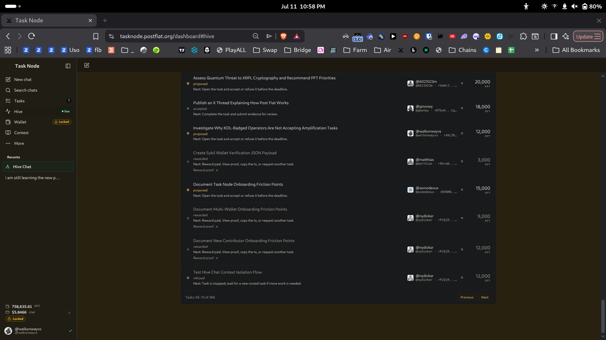
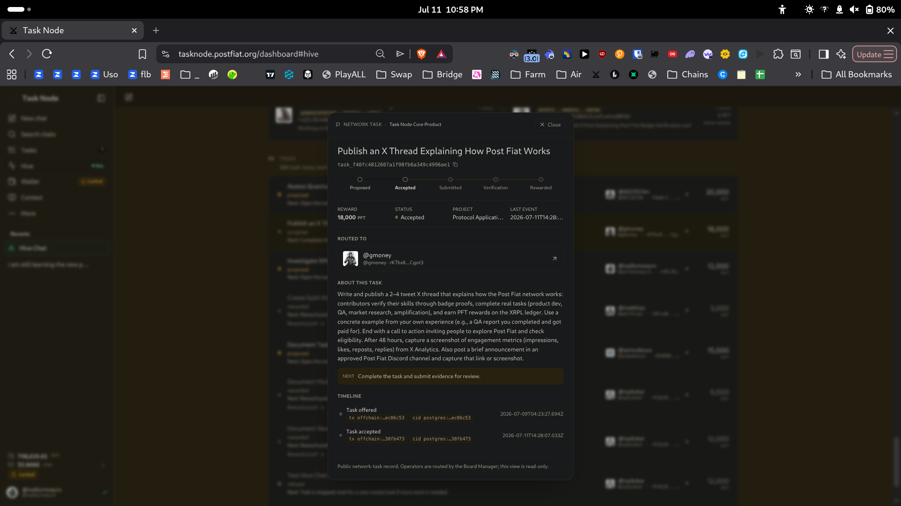
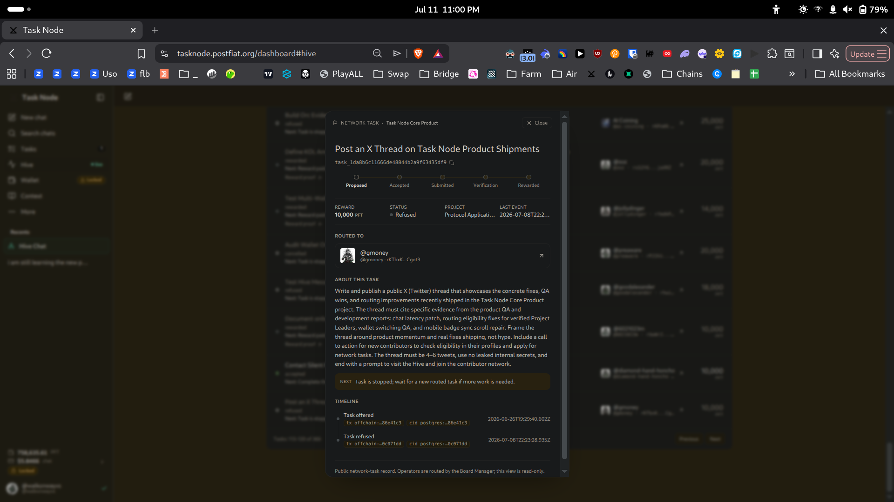
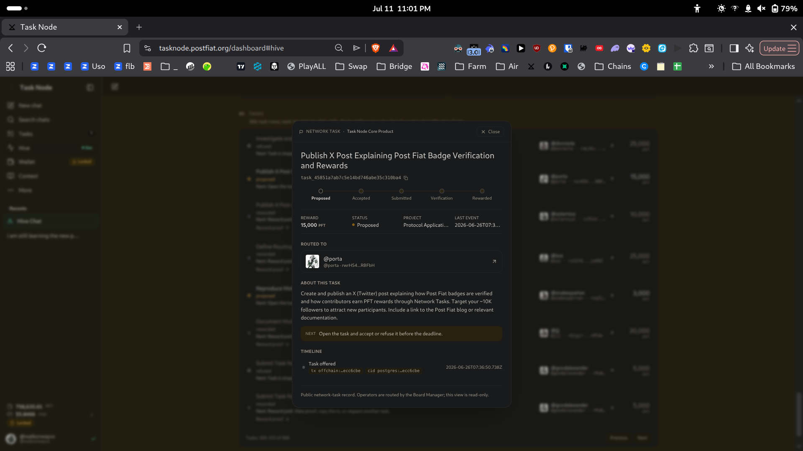
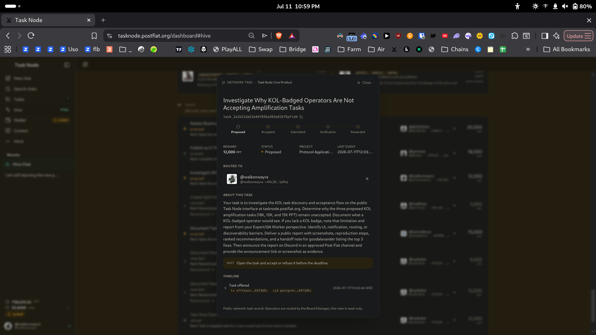
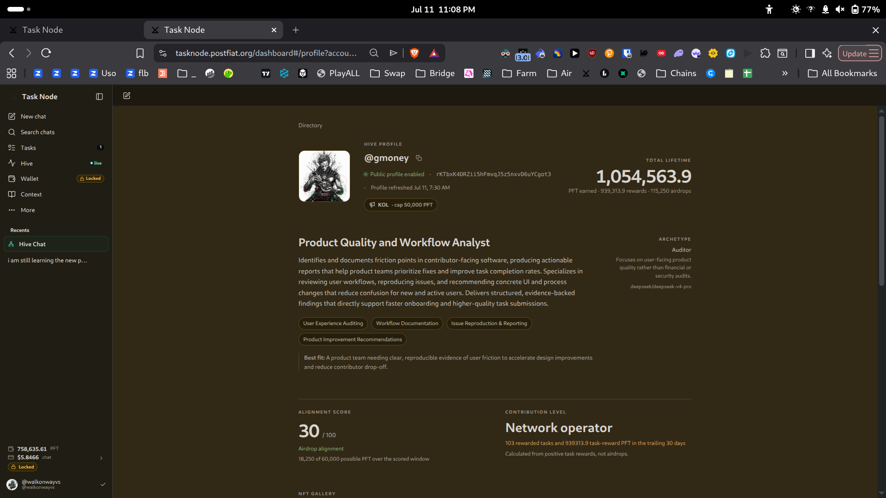
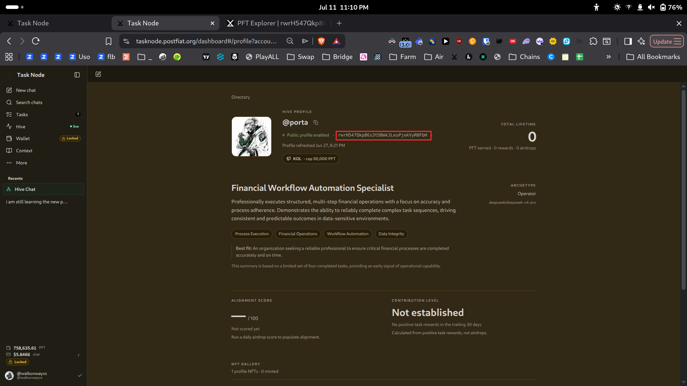
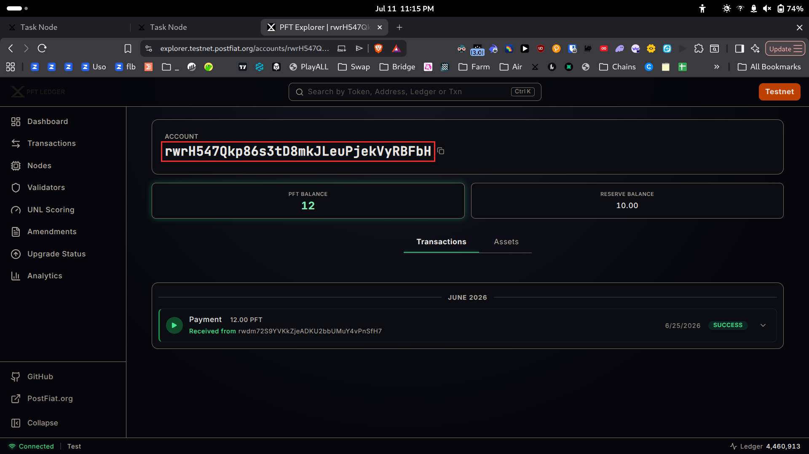
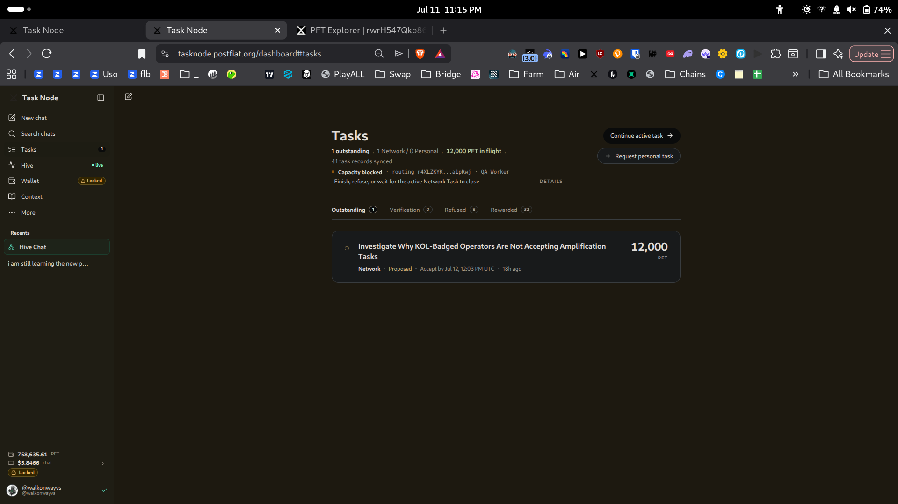

# KOL Amplification Task Acceptance Audit

**Task:** `task_2a1b31da51b44f83ba303a92bf6afcd4` — Investigate Why KOL-Badged Operators Are Not Accepting Amplification Tasks
**Operator:** @walkonwayvs (`r4XLZK...1pRwj`) — Expert / QA Worker. **I do not hold the KOL badge.**
**Date:** 2026-07-12
**Interface:** tasknode.postfiat.org

---

## Summary

The task premise is that three proposed KOL amplification tasks (18K, 10K, 15K PFT) "remain unaccepted." **That is not what the public task records show.**

At the moment this task was routed to me (`2026-07-11T12:03:42.149Z`), of the three named tasks:

- one had **already been refused** 2.5 days earlier,
- one was **accepted 2 hours 24 minutes later**, without any intervention,
- one is **genuinely stalled** — 16 days, zero response.

Only one task is actually stuck. It is stuck for a specific and verifiable reason: **it was routed to a KOL-badged operator who has never completed a task and whose profile has not been touched since one day after routing.** This is not a UI or discoverability failure. It is a routing-to-dormant-operator failure.

The two KOL operators involved behave in opposite ways, and conflating them produces the wrong fix.

---

## Method and claim boundary

**What I could see:** all three task records are public on the Task Node Core Product board (title, ID, reward, status, routed-to operator, full event timeline with timestamps). Both KOL operators have public Hive profiles. One operator's routed wallet is publicly inspectable on the PFT testnet explorer.

**What I could NOT see, and am therefore not claiming:**

- **The KOL-badged operator view.** I hold Expert and QA Worker, not KOL. Every observation below is from the Expert/QA Worker view, as the task brief permits.
- **Refusal notes on other operators' tasks.** The submit/evidence surface is only visible on my own accepted tasks. I can see *that* the 10K task was refused; I cannot see *why* it was refused. That reason is the single highest-value missing datum in this audit and it is not operator-accessible.
- **Any notification the operators did or did not receive.** I can only report the notification surface available to me.

Nothing below is inferred where it is stated as observed, and every inference is labelled.

---

## Evidence: the three named tasks

| Reward | Task | Routed to | Offered | Last event | Status |
|---|---|---|---|---|---|
| 18,000 PFT | Publish an X Thread Explaining How Post Fiat Works `task_f40fc4812607a1f98fb6a349c4996ae1` | @gmoney | 2026-07-09T04:23:27.694Z | **Accepted** 2026-07-11T14:28:07.033Z | Accepted |
| 10,000 PFT | Post an X Thread on Task Node Product Shipments `task_1da8b6c11666de48844b2a9f63435df9` | @gmoney | 2026-06-26T19:29:40.602Z | **Refused** 2026-07-08T22:23:28.935Z | Refused |
| 15,000 PFT | Publish X Post Explaining Post Fiat Badge Verification and Rewards `task_45851a7ab7c5e14bd746abe35c310ba4` | @porta | 2026-06-26T07:36:50.738Z | *(none — one event only)* | **Proposed, 16 days** |

My own task was offered `2026-07-11T12:03:42.149Z`. Measured against that instant:

- The 10K had been **refused for 2 days, 13 hours**.
- The 18K was accepted **2 hours 24 minutes after** my task was created.
- The 15K had been sitting **15 days** with a single lifecycle event: *Task offered*.

---

## Finding 1 — @gmoney is not failing to accept. He is deciding.

@gmoney holds **KOL (cap 50,000 PFT)**. His public profile shows **1,054,563.9 PFT lifetime**, and **103 rewarded tasks / 939,313.9 task-reward PFT in the trailing 30 days**. Profile refreshed 2026-07-11.

This operator is among the most active on the network. He received both of his amplification tasks, **refused one and accepted the other**. Both are recorded, deliberate lifecycle actions.

There is no discovery problem here. There is no notification problem here. Whatever caused the 10K refusal is a *content or incentive* decision, and the refusal note that would explain it is not visible to me.

**Confidence: high (observed).** Two recorded lifecycle transitions, plus profile activity data.

---

## Finding 2 — @porta's task is stalled because @porta has never done anything.

@porta holds **KOL (cap 50,000 PFT)**. His public profile shows:

- **Total lifetime: 0 PFT** — 0 rewards, 0 airdrops.
- **Contribution level: Not established** — "No positive task rewards in the trailing 30 days."
- **Alignment score: not scored yet.**
- **Profile last refreshed: 2026-06-27, 6:21 PM.**

The 15K task was routed to him **2026-06-26T07:36:50Z**. His profile was refreshed the next day, and never again. He has never completed a task on the network.

His routed wallet (`rwrH547Qkp86s3tD8mkJLeuPjekVyRBFbH`) confirms the same picture independently on the PFT testnet explorer: **balance 12 PFT, exactly one transaction ever** — a 12.00 PFT payment received 2026-06-25 from `rwdm72S9YVKkZjeADKU2bbUMuY4vPnSfH7`. No outbound activity, no subsequent transactions.

**Observed:** the operator holds a KOL badge, has zero completed tasks, zero rewards, a profile untouched since 2026-06-27, and a wallet with a single inbound funding transaction.

**Inferred (not confirmed):** this pattern is consistent with an operator who onboarded, obtained the badge, and did not return. I cannot confirm intent, and I cannot confirm whether he ever saw the offer.

**Noted inconsistency, unexplained:** @porta's archetype panel states the summary is *"based on a limited set of four completed tasks,"* while the same profile reports 0 rewards and no established contribution level. I cannot reconcile these two statements from public data. Flagging it as observed; I make no claim about the cause.

---

## Finding 3 — an offer is only discoverable by logging in and looking.

The only surface on which a routed task offer appears to me is the **Tasks item in the left sidebar**, which shows a numeric count. There is no email, no push, no in-app alert, and no external channel.

An operator who does not open tasknode.postfiat.org will not learn that a task has been routed to them.

This matters directly for @porta: a 15,000 PFT task has been sitting for 16 days, addressed to someone whose only recorded interaction with the platform ended on 2026-06-27. Under the current notification model, nothing would ever tell him it exists.

**Confidence: high for my own account (observed).** I cannot confirm that no other notification channel exists for KOL-badged accounts specifically.

---

## Finding 4 — the Hive does not surface these tasks, and is read-only.

The Hive board displays **one "Next reward task" per project** — five entries against a stated 28 open tasks. None of the three KOL amplification tasks appears anywhere on the Hive board.

I located all three only by opening the Task Node Core Product board and paging through 366 task rows, searching by reward amount.

Every network-task record carries the footer: *"Public network-task record. Operators are routed by the Board Manager; this view is read-only."*

**Observed:** there is no surface from which an operator can browse tasks routed to them from the Hive, and no surface from which a task can be accepted other than the operator's own Tasks tab. Discovery of a routed task is entirely dependent on the operator's own Tasks tab.

---

## Ranked recommendations

1. **Do not route tasks to operators with no completion history and no recent activity.** Add a routing eligibility check: if an operator has 0 rewarded tasks and no profile/session activity in N days, do not route a high-value task to them — or route it with a short expiry and reassign. The 15K has been dead for 16 days because it was addressed to someone who was not there. This single change fixes the only genuinely stalled task in the set.

2. **Expire and reassign unaccepted offers.** Task offers to me carry a 24-hour accept deadline ("Accept by Jul 12, 12:03 PM UTC"). The 15K task has been proposed for 16 days with no deadline enforcement visible in its record. Apply an expiry consistently, and on expiry return the task to the board or reroute it. A stalled offer is worse than an unrouted one: it holds the work hostage to a silent operator.

3. **Notify operators out-of-band when a task is routed.** The Tasks sidebar count is the only signal. An operator who does not log in never learns an offer exists. Any push channel — email, Telegram, Discord DM — would have closed the 15K in a day instead of leaving it for 16.

4. **Surface refusal reasons to the network, or at least summarize them.** @gmoney refused the 10K deliberately. The reason is recorded but not operator-visible, which means the network cannot learn from it. If amplification tasks are being refused for a systematic reason (scope, reward, content constraints), that is invisible to everyone auditing from outside.

5. **Make routed tasks discoverable somewhere other than the Tasks tab.** The Hive shows one task per project and is explicitly read-only. An operator has no way to see what has been routed to them except the single sidebar count.

---

## Handoff note for @goodalexander — top 3 fixes

**1. Gate routing on operator liveness.** The only genuinely stalled amplification task (`task_45851a7ab7c5e14bd746abe35c310ba4`, 15,000 PFT) is routed to @porta — KOL-badged, **0 lifetime PFT, 0 completed tasks, profile untouched since 2026-06-27, wallet with a single inbound funding transaction and nothing since**. The task has been proposed for 16 days. Nothing about the UI caused this. The task was sent to someone who is not using the platform. A liveness/eligibility check before routing prevents every recurrence of this.

**2. Enforce an expiry on offers and reroute on lapse.** My own routed task carries a 24-hour accept deadline. @porta's has run 16 days without one. Unaccepted offers should expire and return to the board so the work can be reassigned to an active operator.

**3. Add an out-of-band notification for routed tasks.** Today, the only way an operator learns of an offer is by logging in and seeing the count on the Tasks tab. For an active operator this is fine. For a dormant one it guarantees the task dies silently — which is precisely what happened to the 15K.

**One correction to the premise worth recording:** the three tasks are not uniformly unaccepted. `task_1da8b6c11666de48844b2a9f63435df9` (10K) was **refused** on 2026-07-08, and `task_f40fc4812607a1f98fb6a349c4996ae1` (18K) was **accepted** on 2026-07-11 — 2h24m after this audit task was generated. Both actions predate or immediately follow the task's creation. If the routing system generated this task from a snapshot describing all three as unaccepted, that snapshot was already stale at generation time.

---

## Limitations

- Reported from the **Expert / QA Worker** view. I do not hold KOL and cannot confirm what a KOL-badged operator sees.
- **Refusal notes on other operators' tasks are not operator-visible.** The reason @gmoney refused the 10K task is unknown to me and is the most important gap in this audit.
- I cannot confirm whether @porta ever received or saw the offer.
- I cannot confirm whether notification channels exist for KOL accounts that do not exist for mine.
- The @porta archetype/completed-task inconsistency is reported as observed, with no claimed cause.

---

*Report by @walkonwayvs · Post Fiat testnet validator operator (pft.bigwoodnode.com) · pft-qa-reports*
