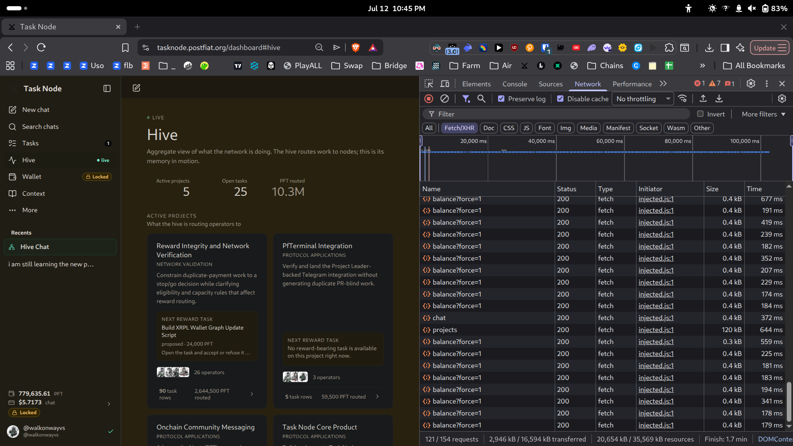
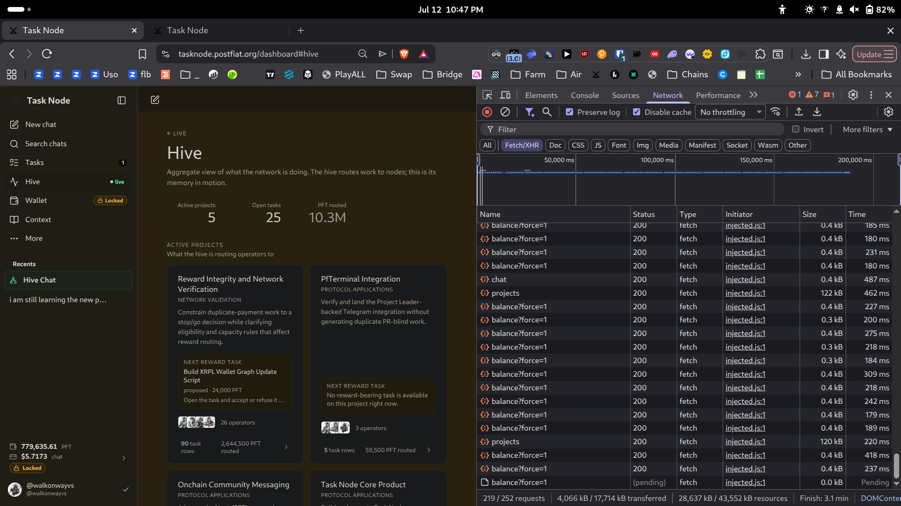
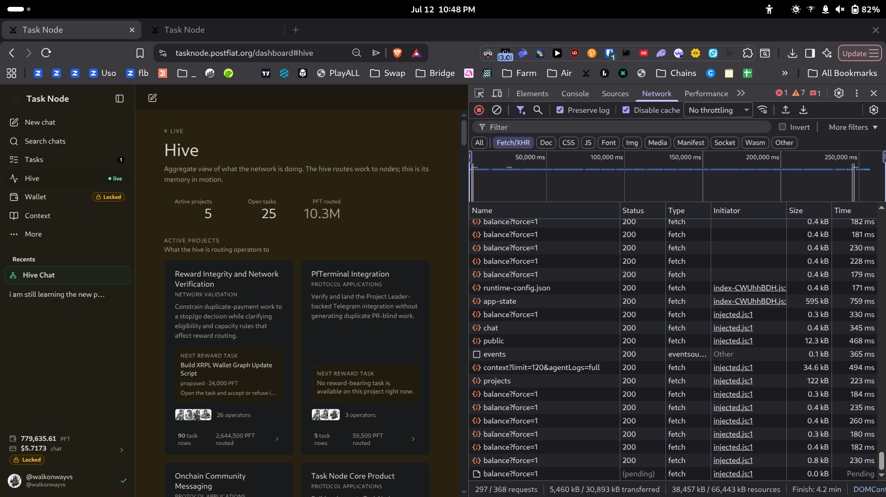
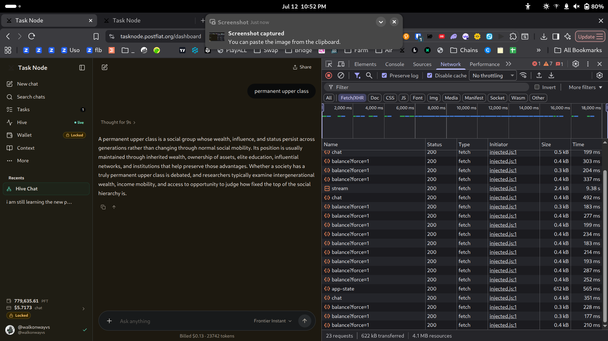
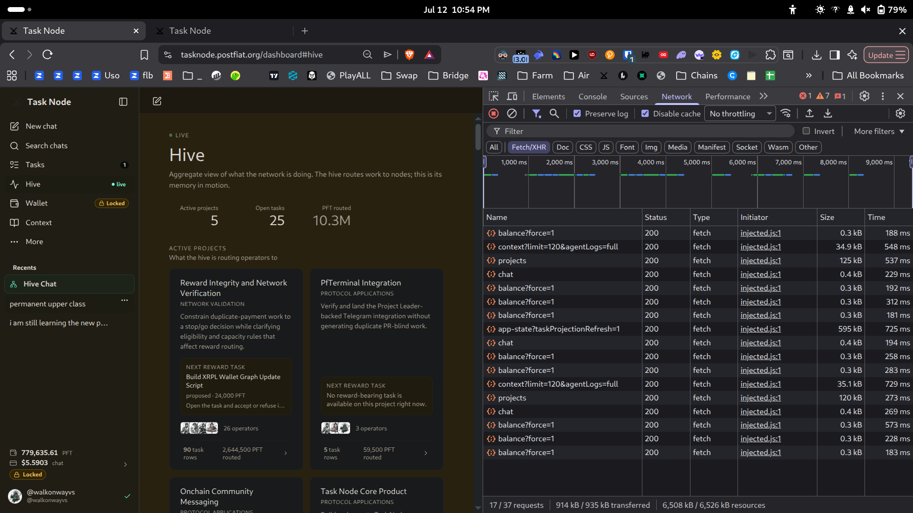

# Hive Tab Concurrent Load — Timing Diagnostic

**Task:** `task_b14b5cb0d44ad96546324bf987ccede0` — Reproduce and Diagnose Hive Tab Concurrent Load Latency with Timing Evidence
**Fix task this supports:** `task_04037f`
**Operator:** @walkonwayvs (`r4XLZK...1pRwj`) — Expert / QA Worker
**Date:** 2026-07-13
**Environment:** Brave (Chromium), Pop!_OS Linux. DevTools Network panel, **Disable cache** on, **Preserve log** on, private window, logged in.
**Timing source:** Chrome DevTools Network panel. No stopwatch — every number below is read directly off the Network panel's `Time` column and status bar.

---

## Summary

**The reported symptom — the Hive tab becoming slow or unresponsive — is real, but the cause is not per-request latency.**

Across all three load scenarios, individual HTTP requests stayed fast. Nothing degraded into the multi-second range. Every request returned HTTP 200.

What degrades is **volume**. The Hive tab issues an unbounded, continuously repeating stream of background fetches that never settle. Request count, bytes transferred, and session duration climb monotonically for as long as the tab is open, and they climb faster with each additional tab. Under concurrent load, `balance?force=1` requests begin entering a **Pending** state and do not resolve.

This is a request-volume and caching problem, not a slow-endpoint problem. A fix that optimises individual endpoint latency will not address it.

---

## Reproduction steps

1. Open a fresh private browser window.
2. Open DevTools (F12) → **Network** tab. Check **Disable cache**. Check **Preserve log**.
3. Log in to tasknode.postfiat.org.
4. **Scenario 1 (baseline):** navigate to the Hive tab. Let it load. Leave it open and idle. Record the Network status bar.
5. **Scenario 2 (concurrent):** with the first Hive tab still open and recording, open a second browser tab and navigate it to the Hive tab. Return to the first tab and observe the Network panel.
6. **Scenario 3 (rapid refresh):** hard-refresh the Hive tab repeatedly (Ctrl+Shift+R, five to six times in quick succession). Observe the Network panel.
7. For the per-operation measurements, clear the Network log (⊘) before each action so the action is measured in isolation.

---

## Timing measurements — three load scenarios

| Scenario | Requests | Transferred | Resources | Session duration ("Finish") |
|---|---|---|---|---|
| **1 — Single tab, idle** | 121 / 154 | 2,946 kB | 20,654 kB | 1.7 min |
| **2 — Two Hive tabs, concurrent** | 219 / 252 | 4,066 kB | 28,637 kB | 3.1 min |
| **3 — Rapid refresh** | 297 / 368 | 5,460 kB | 38,457 kB | 4.2 min |

Individual request times across all three scenarios: **~170 ms – 760 ms**, all HTTP 200. No timeouts. No multi-second per-request latency.

**The degradation is in the totals, not the individual timings.** From Scenario 1 to Scenario 3, request count rises 121 → 297 (+145%) and bytes transferred rise 2,946 kB → 5,460 kB (+85%), while individual request latency stays effectively flat.

### Pending requests under concurrent load

**Observed:** in Scenario 2 and Scenario 3, `balance?force=1` requests appear with status `(pending)`, size `0.0 kB`, and Time `Pending` — they are issued and do not resolve. This does not occur in the single-tab baseline. It is visible in the Scenario 2 and Scenario 3 screenshots above.

**Not claimed:** I did not measure how long a Pending request ultimately takes to resolve, or whether Pending requests accumulate into a growing backlog over a longer session. Establishing that would require a longer-duration capture than this test performed.

---

## Per-operation measurements

Network log cleared immediately before each action, so each measurement is isolated.

### Chat history loading / page load
Covered by the three scenarios above. The Hive page issues `projects` (120–125 kB), `app-state` (595–612 kB), `context?limit=120&agentLogs=full` (~35 kB), `chat`, and a continuous stream of `balance?force=1` (~0.3–0.4 kB each). All complete in 170–760 ms.

### Sending a message

| Request | Size | Time |
|---|---|---|
| `stream` | 2.4 kB | **9.38 s** |
| `app-state` | 612 kB | 565 ms |
| `chat` | 0.4–0.5 kB | 199–492 ms |
| `balance?force=1` (×14, during the send) | 0.3–0.4 kB each | 177–337 ms |

**23 requests / 622 kB transferred for a single message send.**

**Observed:** the `stream` request took 9.38 s. The UI itself displayed "Thought for 9s" for the same interaction.

**Inferred, not confirmed:** the 9.38 s is very likely LLM inference and token streaming — i.e. expected behaviour for an AI response, not a front-end defect. **I am explicitly NOT reporting this as the latency bug.**

**What IS notable:** during those 9.38 seconds, `balance?force=1` fired **fourteen times** in the background. The polling loop does not back off while a request is in flight. `app-state` (612 kB) was also refetched during the send.

### Task list rendering / tab switching

Cleared the log, then clicked **Hive → Tasks → Hive** (three navigations, ~9 s total).

| Request | Size | Time |
|---|---|---|
| `projects` (1st) | 125 kB | 537 ms |
| `projects` (2nd) | 120 kB | 273 ms |
| `context?limit=120&agentLogs=full` (1st) | 34.9 kB | 548 ms |
| `context?limit=120&agentLogs=full` (2nd) | 35.1 kB | 729 ms |
| `app-state?taskProjectionRefresh=1` | 595 kB | 725 ms |
| `chat` (×3) | 0.4 kB each | 194–269 ms |
| `balance?force=1` (×8) | 0.3 kB each | 181–573 ms |

**17 / 37 requests, 914 kB transferred, for three tab clicks.**

**Observed:** leaving the Hive tab and returning re-fetches the full payload. `projects` and `context` were each fetched twice within the same ~9 s window, returning near-identical payloads (125 kB / 120 kB; 34.9 kB / 35.1 kB). `app-state` returned 595 kB. Nothing was served from cache between switches.

---

## Which operations degrade most

Ranked by measured impact:

1. **Tab switching / returning to Hive** — 914 kB and 17 requests for three clicks, with duplicate `projects` and `context` fetches inside a 9-second window. No caching between navigations. This is the heaviest operation per user action.
2. **The idle background poll (`balance?force=1`)** — fires continuously and never stops. It accounts for the majority of the request count in every scenario and does not back off during an in-flight send (14 fires during a single 9.38 s message).
3. **`app-state` (595–612 kB)** — the single largest payload, refetched on page load, on message send, and on tab switch.
4. **`projects` (120–125 kB)** — refetched repeatedly, including twice within one tab-switch cycle.
5. **Message send (`stream`, 9.38 s)** — the longest single request, but very likely inference time rather than a defect. Listed for completeness, not as a bug.

---

## Ranked suspected bottleneck areas

These are **inferred from network behaviour only**. I do not have access to the front-end source and I am not claiming to know the implementation.

1. **Unbounded background polling with no backoff.** `balance?force=1` fires continuously and does not pause or back off during an in-flight request or while a message is streaming. With N tabs open, this is N polling loops. This is the most likely direct cause of degradation under concurrent load, and it lines up with the fact that the requests that go Pending are precisely these.

2. **No client-side caching between navigations.** `projects`, `context`, and `app-state` are re-fetched in full on every tab switch, returning near-identical payloads seconds apart. Caching or a short TTL on these would eliminate the largest per-action cost measured.

3. **Oversized `app-state` payload (595–612 kB).** Fetched on load, on send, and on switch. If a full state snapshot is being returned where a delta would do, this is the biggest single win available.

4. **Full re-fetch rather than incremental update on the LIVE view.** The Hive LIVE view accumulates requests and bytes without bound for as long as it is open, and never settles. Request count and transferred bytes climb monotonically with session age.

5. **Request queueing / connection exhaustion under concurrency.** The Pending `balance?force=1` requests under multi-tab load are consistent with requests queueing behind a saturated connection pool or a rate-limited endpoint. **This is the least-confident item on this list** — I observed the Pending state but did not diagnose its cause.

---

## Handoff note for @goodalexander

**The Hive tab does not have a slow-endpoint problem. It has a request-volume problem.** Every individual request in this test returned HTTP 200 in 170–760 ms, across single-tab, two-tab-concurrent, and rapid-refresh conditions. Nothing was slow.

What degrades is the sheer number of requests. A single idle Hive tab accumulates 121 requests / 2,946 kB and keeps climbing indefinitely. Two concurrent tabs: 219 requests / 4,066 kB. Rapid refresh: 297 requests / 5,460 kB. The `balance?force=1` poll fires continuously with no backoff — fourteen times during a single 9-second message send — and under concurrent load these are the requests that go **Pending** and stop resolving.

**The fix task (`task_04037f`) should target three things, in this order:**

1. **Throttle or back off the `balance?force=1` poll.** It is the bulk of the request count, it does not pause during in-flight work, and it is the request that goes Pending under load. This is the highest-leverage change.
2. **Cache `projects`, `context`, and `app-state` across tab navigations.** Three tab clicks currently cost 914 kB, including `projects` and `context` fetched twice inside nine seconds with near-identical payloads.
3. **Reduce or delta-encode `app-state` (595–612 kB).** It is the largest payload in the app and it is refetched on load, on send, and on switch.

Optimising endpoint response times will not help. They are already fast.

---

## Limitations

- Timing data comes from the DevTools Network panel on a single client (Brave/Chromium, Pop!_OS, one network connection). Results on other browsers, machines, or connections may differ.
- Concurrency was simulated with multiple browser tabs on one account, not with multiple simultaneous operators. Real 33-operator concurrent load is not reproducible from a single operator seat.
- I did not measure how long a Pending request ultimately takes to resolve, nor whether Pending requests accumulate into a growing backlog over a long session.
- The 9.38 s `stream` request is reported as an observation. I infer it is LLM inference time and I am not claiming it as a defect.
- Bottleneck areas are inferred from network behaviour only. I have no access to the front-end source and make no claim about the implementation.

---

*Report by @walkonwayvs · Post Fiat testnet validator operator (pft.bigwoodnode.com) · pft-qa-reports*
