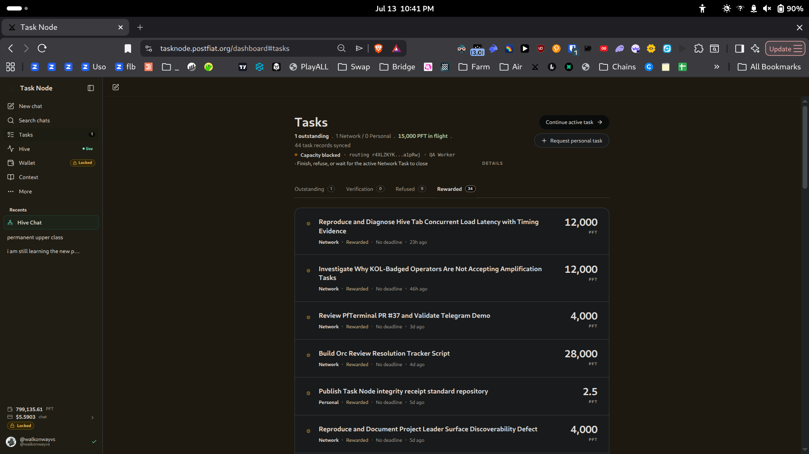
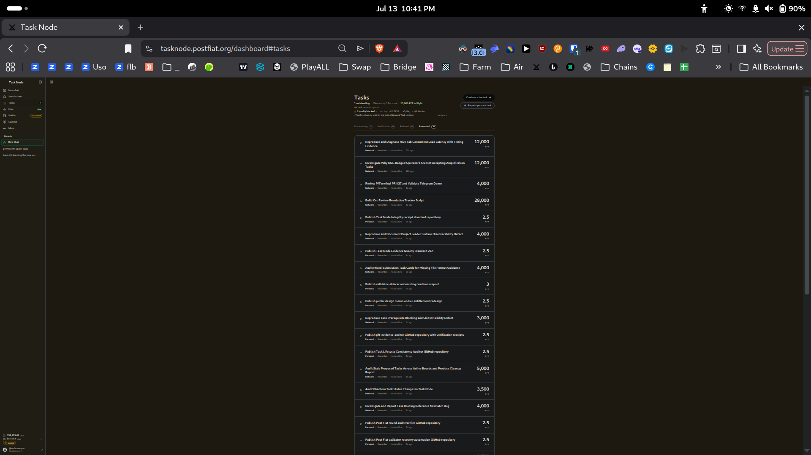
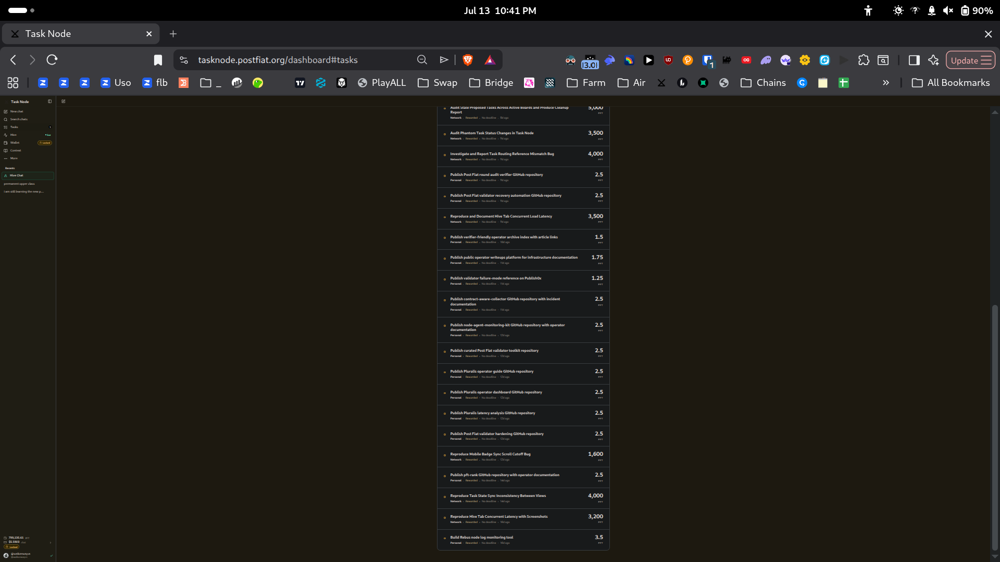
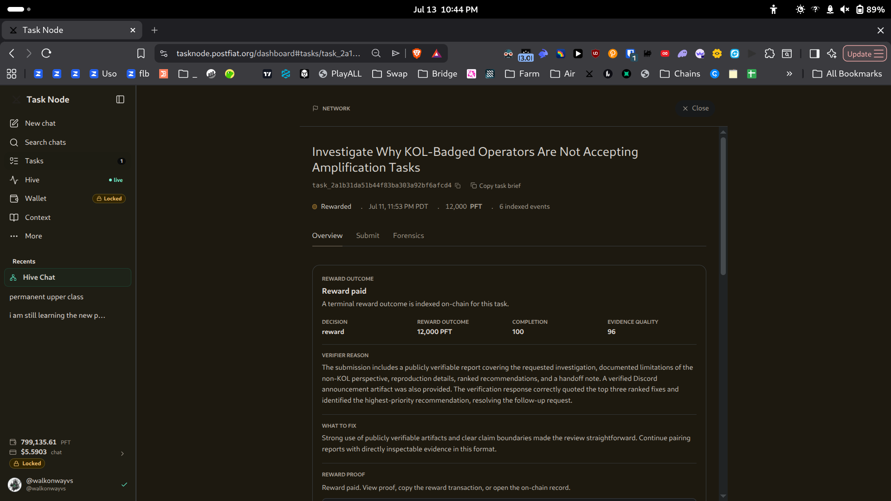
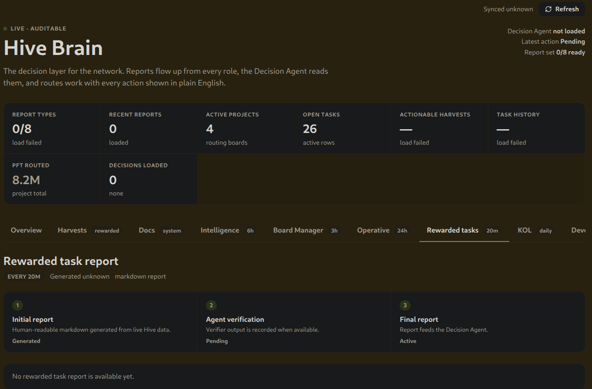
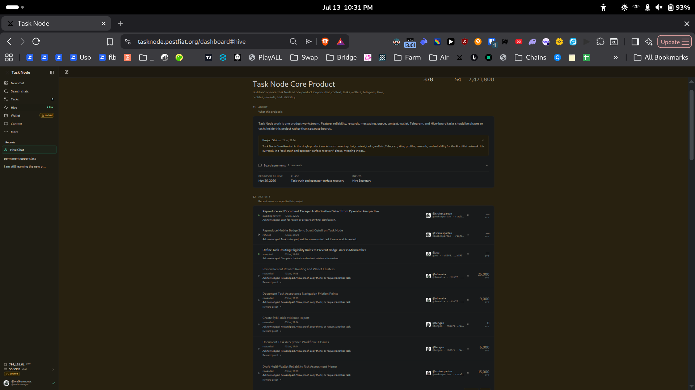
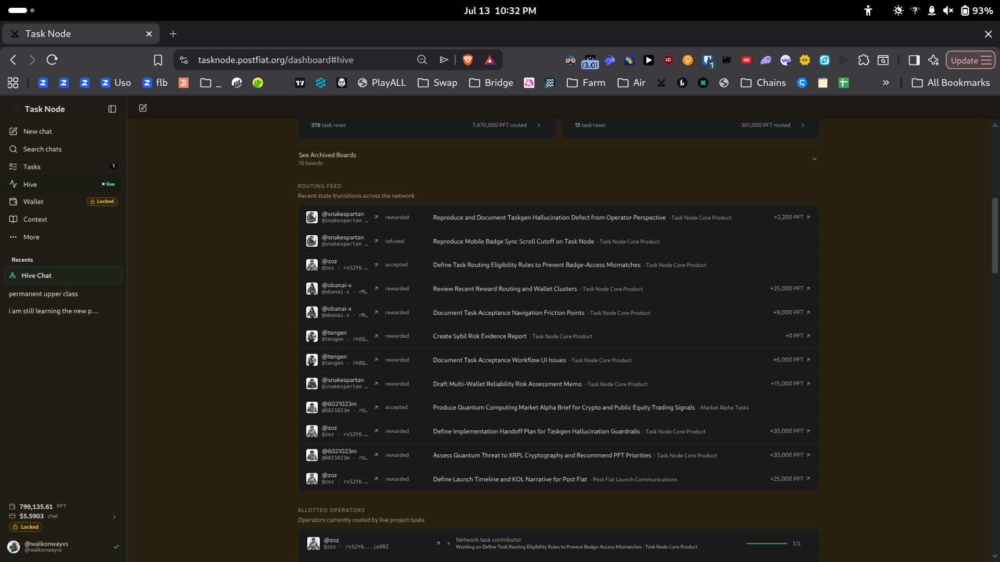

# Task History Loss — Root Cause Diagnostic

**Task:** `task_8d90f12fb780d7bbd3ca612243c2eba6` — Diagnose Root Cause of Task History Loss in Task Node
**Operator:** @walkonwayvs (`r4XLZK...1pRwj`) — Expert / QA Worker
**Date:** 2026-07-14
**Interface:** tasknode.postfiat.org, Brave (Chromium), Pop!_OS Linux

---

## Root cause determination

**Neither data-layer loss, display-layer rendering failure, nor a migration gap.**

Task records are intact and reachable. My own task history is complete and internally consistent, and every task ID I tested — spanning my entire history back to my oldest rewarded task — loads correctly by direct URL.

**The actual failure is in the Hive Brain reporting layer.** Hive Brain's dashboard reports `TASK HISTORY — load failed`, and none of its eight report types are generating (`Report set 0/8 ready`, `Recent reports 0`, `Decision Agent not loaded`). The task records exist; the layer that reads and summarises them is down.

"Task history loss" is what a broken reporting layer looks like from the outside. Nothing has been lost.

---

## Reproduction steps

1. Log in to tasknode.postfiat.org.
2. Open the **Tasks** tab. Record the tab counts (Outstanding / Verification / Refused / Rewarded) and the "task records synced" figure in the header.
3. Count the task entries actually rendered in the Rewarded list. Compare against the Rewarded tab count.
4. Sum all four tab counts. Compare against the "task records synced" figure.
5. Open any rewarded task, copy the URL. The pattern is `https://tasknode.postfiat.org/dashboard#tasks/<task_id>`.
6. In a fresh window, open five task IDs from across the full span of your history by direct URL. Record which load and which fail.
7. Open **Hive** → **Hive Brain**. Record the dashboard tiles and the state of each report tab.

---

## Test 1 — Is my task history complete? Yes.

Header: **"44 task records synced."**

| Tab | Count |
|---|---|
| Outstanding | 1 |
| Verification | 0 |
| Refused | 9 |
| Rewarded | 34 |
| **Total** | **44** |

**44 = 44. Exact match.** No records unaccounted for.

I then counted the entries actually rendered in the Rewarded list: **34 tasks displayed**, matching the Rewarded tab count of 34 exactly. Nothing is missing from the render.

The list spans my full history, from my most recent rewarded task (23h ago) back to my oldest (16d ago), with no gaps in the sequence.

---

## Test 2 — Are historical task records reachable? Yes. All of them.

Task records are directly addressable at `https://tasknode.postfiat.org/dashboard#tasks/<task_id>`.

I tested five task IDs drawn from across my entire history, in a fresh window:

| # | Task ID | Task | Age | Result |
|---|---|---|---|---|
| 1 | `task_bf27b603d62f0b54b9853c4e1c2fc4f2` | Build Rebus node log monitoring tool | 16d (oldest) | **Loads** |
| 2 | `task_444a37bd857447c1af2713d570acc382` | Reproduce Mobile Badge Sync Scroll Cutoff Bug | 12d | **Loads** |
| 3 | `task_e61617f097a7b2305727697400d9fdf9` | Publish contract-aware-collector GitHub repository | 11d | **Loads** |
| 4 | `task_cd70658b82d251405f08fa3ff8c7a58f` | Publish verifier-friendly operator archive index | 10d | **Loads** |
| 5 | `task_2a1b31da51b44f83ba303a92bf6afcd4` | Investigate Why KOL-Badged Operators Are Not Accepting Amplification Tasks | 46h | **Loads** |

**5 of 5 load. Zero failures.** Including my oldest rewarded task.

Each loads with its full record: title, task ID, status, reward, indexed event count, reward outcome, completion and evidence-quality scores, verifier reason, and reward proof. The screenshot below shows task 5 loaded from a direct URL, reporting "6 indexed events" and a complete on-chain reward record.

**There is no data-layer loss. There is no display-layer rendering failure. There is no migration gap in these records.**

---

## Test 3 — Where the failure actually is: Hive Brain

Hive Brain is the network's reporting and decision layer. Its own dashboard reports the failure in plain text:

| Tile | Value |
|---|---|
| **TASK HISTORY** | **— load failed** |
| **ACTIONABLE HARVESTS** | **— load failed** |
| **REPORT TYPES** | **0/8 — load failed** |
| RECENT REPORTS | 0 loaded |
| DECISIONS LOADED | 0 — none |
| Decision Agent | **not loaded** |
| Latest action | Pending |
| Report set | **0/8 ready** |

The **Rewarded tasks** report tab — the report that would produce authoritative task-history counts — states: **"No rewarded task report is available yet."** Its pipeline shows *Initial report: Generated*, *Agent verification: Pending*, *Final report: Active* — generated but never verified, so never published.

This is not one broken report. **Zero of eight report types are ready.**

---

## Test 4 — Count discrepancies (and why the brief's expected counts can't be sourced)

The task brief instructed me to compare visible counts against **"the expected counts from the latest Hive QA report (50 rewarded tasks, 33 active tasks)."**

**That report does not exist.** The Rewarded tasks tab in Hive Brain says so directly (above). I could not source the figures 50 and 33 from any surface available to me, and I am not able to verify them.

What I *can* count, and what does not reconcile:

- **Task Node Core Product board header:** 378 task rows · 54 operators · **7,471,800 PFT routed**
- **Task Node Core Product board card, same page:** 378 task rows · **7,470,000 PFT routed**

**Two different PFT-routed figures for the same board, rendered on the same page, 1,800 PFT apart.** Task-row counts agree (378); the PFT totals do not.

Separately, the Hive Brain dashboard reported **4 active projects / 26 open tasks / 8.2M PFT routed**, while the Hive board at the same time showed **5 active projects**. These two surfaces disagree about how many projects are active.

**Observed:** these figures do not reconcile across surfaces.
**Inferred, not confirmed:** this is consistent with different surfaces reading from different aggregation paths, at least one of which is stale or partially failing. I cannot see the implementation and I do not claim to know the cause.

---

## Classification of "missing" tasks

The brief asks me to classify each missing task as data loss, display fault, or migration-inaccessible.

**No missing tasks were found.** Every task in my history is present, counted, and individually reachable. The classification table is empty, and that is the finding.

| Category | Count | Task IDs |
|---|---|---|
| Data-layer loss | **0** | — |
| Display-layer rendering failure | **0** | — |
| Inaccessible due to migration | **0** | — |

---

## Recommended fix area for core contributors

**Target the Hive Brain report pipeline, not the task data store.**

The task records are intact, correctly counted, and individually retrievable by direct URL. Any effort spent auditing or repairing the task data layer will find nothing wrong with it.

Ranked:

1. **Fix the Hive Brain report loader.** `TASK HISTORY: load failed`, `ACTIONABLE HARVESTS: load failed`, `REPORT TYPES: 0/8 load failed`, `Decision Agent: not loaded`. Zero of eight report types are generating. This is the single failure that produces the "task history loss" symptom, and it is failing across the board rather than in one report — pointing at the loader or its data source, not at individual report logic.

2. **Fix the report verification step.** The Rewarded tasks report shows *Initial report: Generated* but *Agent verification: Pending* — reports are being generated and then stalling at verification, so they never publish. If the Decision Agent is what performs that verification and it is "not loaded," these two failures are likely the same failure.

3. **Reconcile the aggregation paths behind the board counts.** The same board reports two different PFT-routed totals on one page (7,471,800 vs 7,470,000), and Hive Brain and the Hive board disagree on the active-project count (4 vs 5). Whatever feeds these surfaces is not consistent.

4. **Stop generating tasks from unavailable reports.** This task's own brief cites "the latest Hive QA report (50 rewarded tasks, 33 active tasks)" — a report that does not exist and whose figures I cannot source. If the task generator is reading expected counts from a report set that is 0/8 ready, it is producing task briefs from state it cannot actually see.

---

## Limitations

- Tested against **my own** task history (44 records). I cannot see other operators' Tasks tabs and cannot confirm their histories are equally intact.
- I tested 5 task IDs by direct URL, not all 44. All 5 loaded, including the oldest.
- I could not source the brief's "expected counts (50 rewarded, 33 active)" from any surface available to me, so I could not test against them.
- Hive Brain's failure is reported here exactly as the interface reports it. I have no access to the backend and make no claim about *why* the loader is failing.
- The count-discrepancy causes are inferred from surface behaviour only.

---

*Report by @walkonwayvs · Post Fiat testnet validator operator (pft.bigwoodnode.com) · pft-qa-reports*
