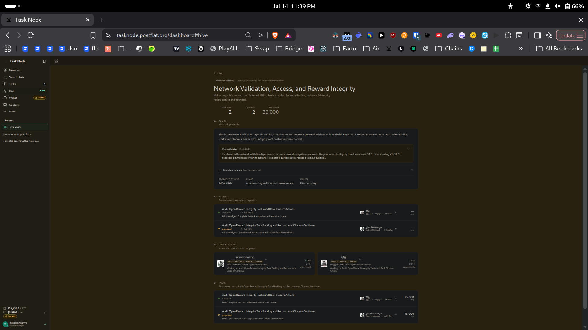
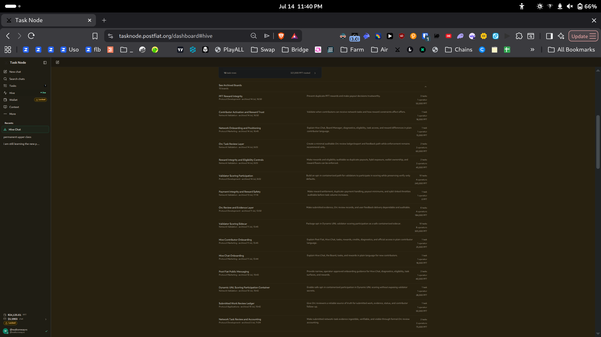

# Reward-Integrity Task Backlog Audit — Close/Continue Recommendations

**Operator:** walkonwayvs (`r4XLZK...`)
**Task:** `task_ef2716852d1a7f446741bed6539e6f20` — Audit Open Reward Integrity Task Backlog and Recommend Close or Continue
**Date:** 2026-07-15
**Method:** Operator-facing Task Node interface and Hive board only. No core repo, harvest records, or private internal boards.

---

## 1. Inventory of locatable reward-integrity tasks

Two tiers, split by what the operator view exposes.

### Tier A — Open reward-integrity tasks (live board, full detail)

Board: **Network Validation, Access, and Reward Integrity** (2 task rows, 30,000 PFT routed).

| Task ID | Objective | PFT | Status |
|---|---|---|---|
| `task_ef2716852d1a7f446741bed6539e6f20` | Audit open reward-integrity backlog, recommend close/continue | 15,000 | Proposed |
| `task_6ad9dc08ef0493cb7532fb79e4673e42` | Audit open reward-integrity tasks, rank closure actions | 15,000 | Accepted (@jjj) |

These two are near-identical audits of the same backlog, routed to two operators.

### Tier B — Archived reward-integrity backlog (board-level detail only)

Individual task cards inside archived boards are **not openable** in the operator view (see Section 5). Detail is limited to what the archived-boards list exposes: board name, description, task count, total PFT.

| Board | Description | Tasks | PFT | Archived |
|---|---|---|---|---|
| PFT Reward Integrity | Prevent duplicate PFT rewards, make payout decisions trustworthy | 3 | 50,000 | 14 Jul 16:50 |
| Reward Integrity and Eligibility Controls | Make rewards/eligibility auditable (duplicate payouts, Sybil, wallet ownership, reward floors) | 2 | 45,000 | 14 Jul 09:03 |
| Contributor Activation and Reward Trust | Validate when contributors can receive tasks, how reward constraints affect offers | 1 | 18,000 | 14 Jul 16:50 |
| Payment Integrity and Reward Safety | Make settlement, duplicate-payment handling, payout minimums, Sybil throttles auditable | 1 | 0 | 13 Jul 17:16 |
| **Total** | | **7** | **113,000** | |

---

## 2. Cost-to-value analysis

- **Original issue scope:** 150,000 PFT duplicate-payment issue.
- **Prior board investigation spend:** over 2,000,000 PFT, per the live board's own Project Status text — a ~13x overspend against the 150K issue, closed with no action. *(Stated by the board; not independently verifiable from operator-visible task cards.)*
- **Archived backlog now holding the work:** 113,000 PFT across 7 tasks, all boards already archived (closed).
- **Only live reward-integrity spend:** 30,000 PFT across the two overlapping meta-audits in Tier A. 15,000 of that is redundant, since both tasks answer the same question.

**Confirmed:** the reward-integrity backlog is already archived. The only genuinely open spend is the 30K on two duplicate audits.
**Inferred:** the 2M+ prior spend, drawn from the board status text.

---

## 3. Recommendations

**Tier A — live board**

- `task_6ad9dc08...` / `task_ef2716...` — **NARROW to one.** The two audits share objective, scope, and source backlog. Completing both spends 30,000 PFT to produce one answer. Keep one, close the other. Running two overlapping meta-audits is itself the unbounded-spend pattern this board was created to bound. **Saves 15,000 PFT.**

**Tier B — archived boards**

- PFT Reward Integrity (50K) — **CLOSE (confirm).** Already archived 14 Jul, superseded by the live bounded board. No forward spend; confirm it stays closed.
- Reward Integrity and Eligibility Controls (45K) — **CLOSE (confirm).** Archived; scope folded into the live bounded board.
- Contributor Activation and Reward Trust (18K) — **CLOSE (confirm).** Archived; no value-at-risk visible.
- Payment Integrity and Reward Safety (0 PFT) — **CLOSE (confirm).** Archived, zero reward routed, nothing at risk.

No archived board warrants continue: each is already closed and none exposes an unresolved value-at-risk from the operator view.

---

## 4. Summary table — ranked by forward PFT savings

| Rank | Task / Board | Recommendation | Justification | Est. PFT saved |
|---|---|---|---|---|
| 1 | Two live meta-audits | Narrow to one | Duplicate audits of one backlog; second is redundant | 15,000 |
| 2 | PFT Reward Integrity | Close (confirm) | Already archived; superseded by live board | 0 (forward) |
| 3 | Reward Integrity and Eligibility Controls | Close (confirm) | Already archived; scope folded in | 0 (forward) |
| 4 | Contributor Activation and Reward Trust | Close (confirm) | Already archived; no value-at-risk | 0 (forward) |
| 5 | Payment Integrity and Reward Safety | Close (confirm) | Archived, 0 PFT routed | 0 (forward) |

Total forward-looking PFT saving from actionable recommendation: **15,000 PFT.** The archived backlog (113,000 PFT, 7 tasks) is already closed and carries no forward spend.

---

## 5. Data boundaries — operator-accessible vs not

**Accessible:**
- Live board task rows, IDs, objectives, PFT, and status (Tier A).
- Archived-boards list: board names, descriptions, task counts, total PFT per board, archive timestamps (Tier B).
- Live board Project Status text (the 2M/150K claim).

**Not accessible from operator view:**
- Individual task cards inside archived boards do not open — no per-task IDs, per-task objectives, or per-task statuses for the 7 archived backlog tasks. Tier B is therefore board-level only.
- The 2M+ prior-board spend is asserted in board status text and cannot be verified against individual archived task rewards, because those cards do not open.
- No harvest records, core repo, or private board data was used, per task scope.

---

## Evidence

**Live board — two overlapping meta-audits + Project Status text:**

**Archived boards — reward-integrity backlog:**

